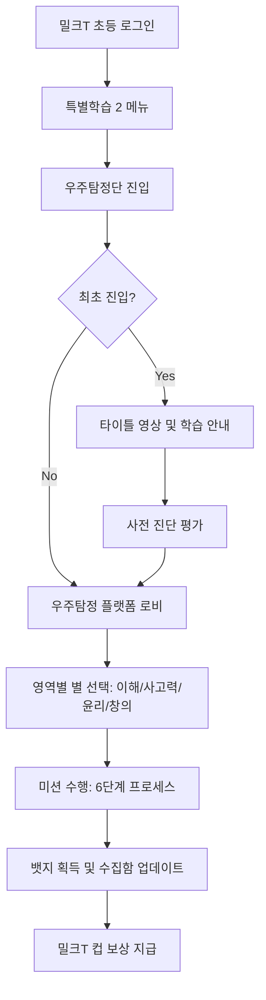

# 🚀 우주탐정단 플랫폼 서비스 정의서

본 문서는 `플랫폼 흐름.png` 구상도를 바탕으로 우주탐정단 서비스의 전체 여정(User Journey)과 단계별 상세 스펙을 정의합니다.

---

## 1. 서비스 전체 흐름도 (Service Flow)

---

## 2. 단계별 상세 정의

### 2.1 진입 및 인트로 (Entry & Intro)

- **진입 경로**: 밀크T 고학년 전용 메뉴 내 '특별학습 2' 섹션.
- **인트로 구성**:
  - 타이틀 영상: 세계관(가짜 뉴스를 잡는 우주탐정단) 소개.
  - 학습 안내(팝업): AI 리터러시 함양 목표 및 뱃지 수집 보상(컵 점수) 안내.
- **[추가 정의 필요]**: 영상 스킵 기능 여부, 소리 조절 버튼 위치, 최초 진입 여부 판단 로직(DB 연동).

### 2.2 사전 진단 평가 (Diagnostic Test)

- **문항 구성**: 5~10문항 (AI 개념, 비판적 사고력 위주).
- **레벨링 로직**:
  - **Level 1**: 이해단계 미달 시 1주차부터 시작.
  - **Level 2**: 이해단계 만점 시 2주차부터 시작.
  - **Level 3**: 비판력 단계 만점 시 3주차부터 시작.
- **[추가 정의 필요]**: 각 레벨별 가중치 점수 산출 공식, 진단 결과 리포트 화면 설계.

### 2.3 우주탐정 플랫폼 (Main Lobby)

- **UI 구조**: 4개의 별(Star) 오브젝트가 배치된 우주 공간 테마.
  - **이해의 별**: AI 개념, 데이터 이해.
  - **사고력의 별**: 판단구조, 오류 탐지, 딥페이크 분석.
  - **윤리의 별**: 데이터 편향성, 프라이버시, 저작권.
  - **창의의 별**: 프롬프트 활용, 인간의 판단, 미래 시나리오.
- **캐릭터 인터랙션**: '우주탐정단' 캐릭터가 말풍선으로 현재 상태(신입 요원 등) 및 미션 가이드 제공.
- **[추가 정의 필요]**: 별 클릭 시 애니메이션(확대/회전), 잠금(Lock) 상태 이미지와 활성 이미지 구분.

### 2.4 미션 해결 프로세스 (Learning Process)

- **6단계 시퀀스**:
  1. **탐색**: 문제 상황 인지 및 증거 탐색.
  2. **문제 풀이**: 초기 가설 설정 및 퀴즈.
  3. **원리 탐색**: AI 기술적 원리 학습(인포그래픽 등).
  4. **미션 해결**: 수집한 증거를 바탕으로 최종 판별.
  5. **최종 퀴즈**: 핵심 개념 확인.
  6. **뱃지 획득**: 성공 시 뱃지 증정 연출.
- **[추가 정의 필요]**: 각 단계별 이탈 시 저장 로직(이어하기), 단계별 소요 시간 트래킹.

### 2.5 보상 시스템 (Badge & Cup)

- **뱃지 수집함**: 12개의 뱃지가 영역별로 배치된 수집 페이지.
- **밀크T 컵 연동**:
  - 영역별(3개 미션) 수집 완료 시 컵 점수 지급.
  - 특별 뱃지(마스터 뱃지) 획득 시 보너스 컵 지급.
- **[추가 정의 필요]**: 컵 지급 시 실시간 토스트 알림 디자인, 포인트 지급 실패 시 재시도 로직.

---

## 3. 플랫폼 최적화를 위한 추가 요구사항

### 3.1 기술적 요구사항 및 구현 방안 (HTML/JS/CSS 기반)

| 구분                  | 요구사항                     | 상세 구현 방안 (Tech Stack)                                                                                          | 비고                     |
| :-------------------- | :--------------------------- | :------------------------------------------------------------------------------------------------------------------- | :----------------------- |
| **그래픽/엔진** | 고성능 2D 그래픽 및 GPU 가속 | **PixiJS (WebGL/Canvas)** 활용. 우주 배경의 동적 오브젝트(별, 행성) 처리 및 부드러운 60fps 유지                | 태블릿 성능 최적화 핵심  |
| **애니메이션**  | 정밀한 타임라인 제어         | **GSAP (GreenSock)** 사용. 캐릭터 등장, 대사창 연출, 뱃지 획득 시퀀스 등 복잡한 애니메이션 구현                | 인터랙션 퀄리티 확보     |
| **리소스 로딩** | 로딩 속도 최적화             | **Lazy Loading** 적용. 메인 로비 진입 시 필수 에셋 선로드, 개별 미션 진입 시 해당 리소스 비동기 로드           | WebP 포맷 권장           |
| **플랫폼 연동** | 밀크T 로그인 및 정보 연동    | **JavaScript Bridge** 통신. 밀크T 앱에서 제공하는 전역 객체를 호출하여 학생 정보(학년, 이름, ID) 획득          | 밀크T 브릿지 명세서 필요 |
| **데이터 저장** | 학습 이력 및 진행도 저장     | **localStorage + Server API**. 미션 내 세부 진행도는 로컬 저장, 최종 미션 결과 및 뱃지는 밀크T API로 서버 전송 | 실시간/배치 전송 선택    |
| **포인트 연동** | 밀크T 컵(CUP) 지급           | **Bridge API 호출**. 미션/영역 완료 시점에 밀크T 포인트 시스템으로 실시간 포인트 지급 요청                     | 지급 성공/실패 처리 필수 |

### 3.2 운영 및 확장 요구사항

- **주차별 확장**: 현재 4주차 커리큘럼 외에 향후 8주차, 12주차로 확장 가능한 메뉴 구조 설계.
- **학부모 연동**: 자녀가 획득한 뱃지 현황을 실시간 푸시 알림으로 학부모 앱에 전송하는 기능.

### 3.3 도움말 시스템

- **가이드 팝업**: 뱃지 수집 방법 및 컵 획득 조건을 상시 확인할 수 있는 도움말 버튼(로비 좌측 하단 배치).
- **[추가 정의 필요]**: 캐릭터 '다시 보기' 기능(캐릭터 클릭 시 최근 대사 재생).
